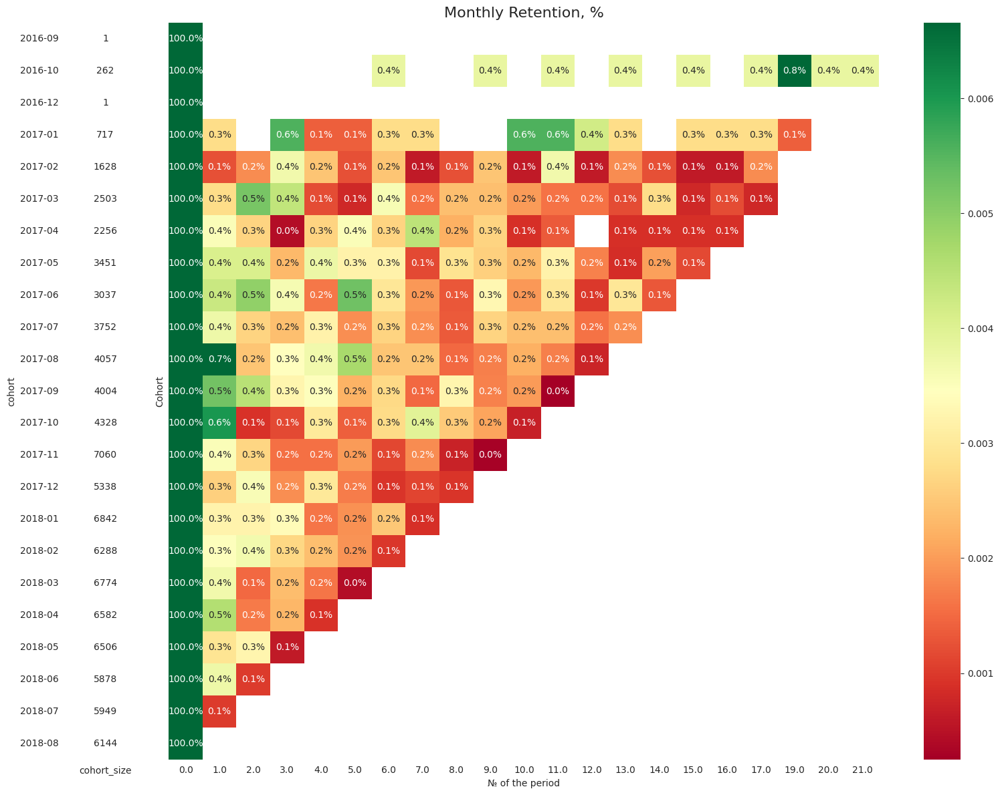
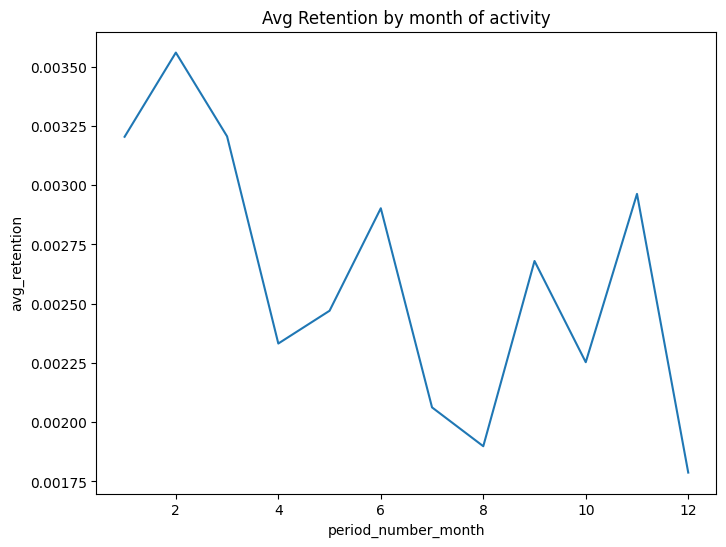
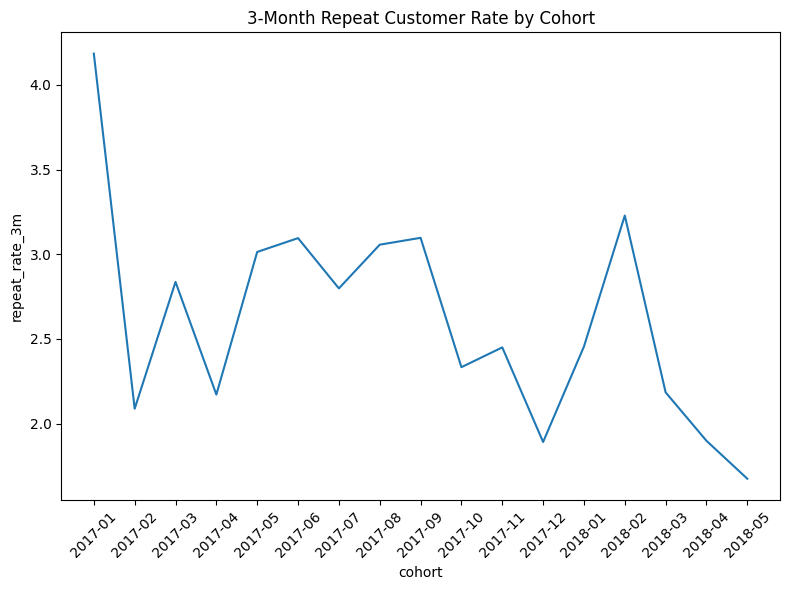
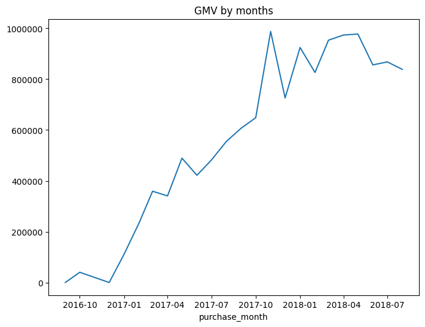
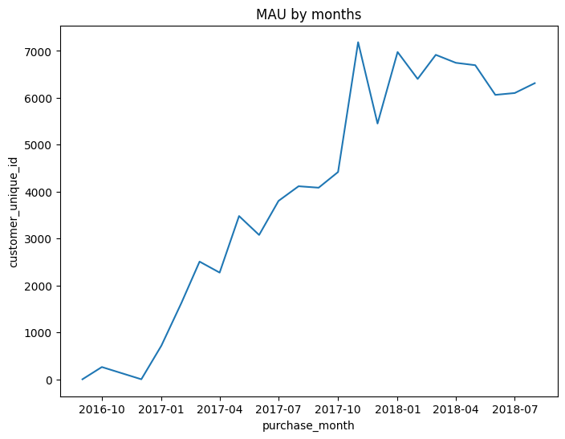
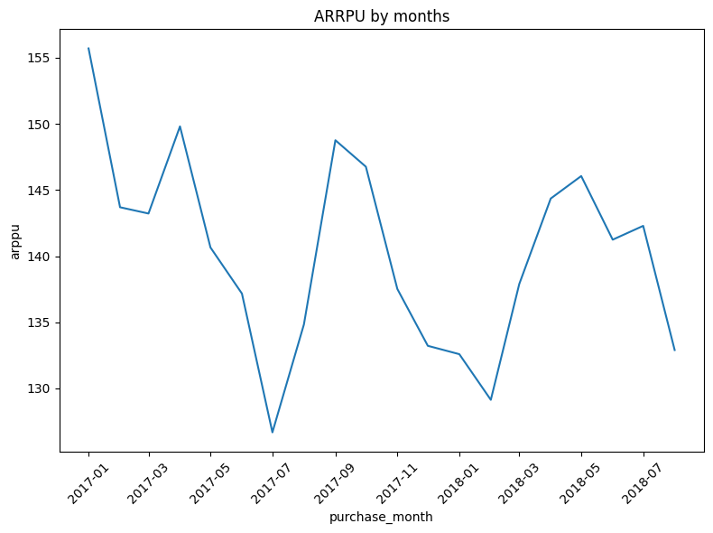

# Marketplace Retention and Growth Analysis

[English](README.md) | [Русский](README.ru.md)

This project analyses data from a startup building a new online marketplace.
The platform recently entered the market in Brazil.

Marketplace revenue has been flat for several months.
The product manager needs to understand how to drive metric growth without creating friction for users.

The goal of this analysis is to explore key performance indicators, identify growth bottlenecks, prioritise hypotheses, and define metrics for future A/B testing

## Overview

* Dataset: anonymised marketplace data (orders, customers, items)
* Period: 2017–2018
* Tools: Python (pandas, matplotlib, seaborn)
* Focus: retention, product–market fit, key growth metrics, hypothesis prioritisation with ICE framework

## Key Steps

1. **Data Preparation**
    - Merged customer, order, and item datasets
    - Checked data consistency and missing values
    - Found anomalies in delivery and approval timestamps
2. **Retention Analysis**
     - Calculated monthly retention based on delivered orders
     - Built a cohort heatmap
     - Median 1st-month retention: 0.35%

 

3. **Product–Market Fit**
    - Only 3% of customers made more than one purchase
    - Retention declines
  

  
  

 

**Conclusion: No product–market fit yet.** Customers don’t return after the first purchase

4. **Performance Metrics**
Defined key metrics to track marketplace growth:
    - Gross Merchandise Value
    - Monthly Active Users
    - Repeat Customer Rate
    - Average Revenue Per Paying User

  
  
   

5. **Hypothesis Testing (ICE Framework)**
 Three improvement hypotheses were evaluated:
 

> H1: Fix order processing bug → fewer cancellations
>  H2: Shorten shipping time → fewer delays, more repeat orders
>   H3: Add new payment option → easier checkout, more repeat customers

 

| Hypothesis | Customers affected | Impact | Confidence | Ease | ICE score |
|:------------|-------------------:|--------:|-------------:|------:|-----------:|
| H1          | 490                | 4       | 8           | 6     | 192        |
| H2          | 25                 | 1       | 10          | 4     | 40         |
| H3          | 289                | 3       | 5           | 9     | 135        |

H1 received the highest ICE score (192 points) and was selected for A/B testing.

6. **A/B Test Design**
    - **Target metric:** Delivery Rate
    - **Proxy metric:** Pick-Up Rate
    - **Guardrail metric:** Order Conversion Rate

## Findings

* Retention and repeat activity are critically low (only 3% of users return).

* The marketplace hasn’t reached product–market fit.

* 8.5% of orders were delayed, and ~1,300 orders had inconsistent timestamps.

* Order processing issues likely block deliveries and lower retention.

## Next Steps
* Run the A/B test for Hypothesis 1 (order processing fix).
* Monitor Pick-Up Rate and Delivery Rate as key indicators.
* Explore new hypotheses for user reactivation and loyalty improvement.
