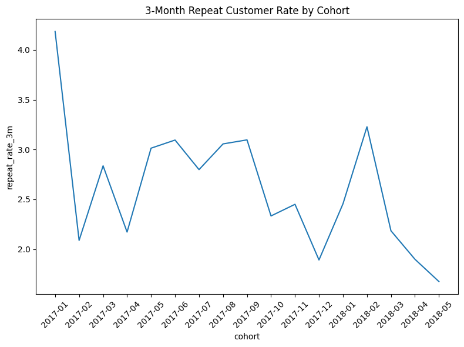
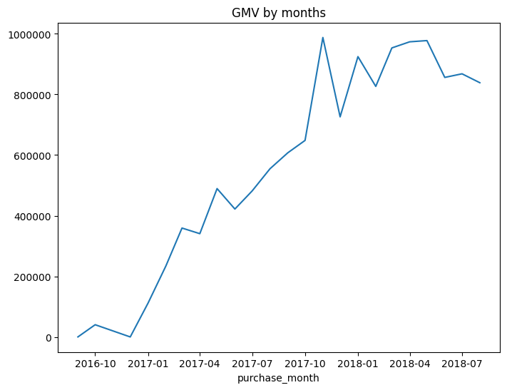
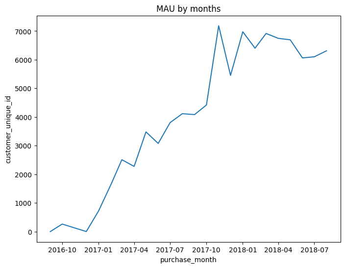
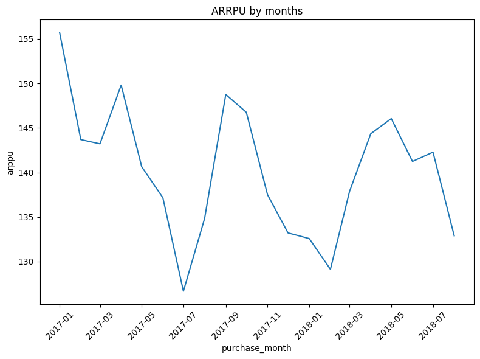

# Анализ удержания и роста маркетплейса
[English](README.md) | [Русский](README.ru.md)

Этот проект основан на данных стартапа, создающего новый онлайн-маркетплейс.
Платформа недавно вышла на рынок Бразилии.

Выручка маркетплейса не растёт уже несколько месяцев.
Продукт-менеджеру нужно понять, как улучшить ключевые метрики, не создавая неудобств для пользователей.

Цель анализа — изучить ключевые показатели, выявить узкие места в росте, приоритизировать гипотезы и определить метрики для будущего A/B-тестирования.

## Обзор

* Данные: анонимизированные данные маркетплейса (заказы, покупатели, товары)
* Период: 2017–2018
* Инструменты: Python (pandas, matplotlib, seaborn)
* Фокус: удержание, product–market fit, ключевые метрики роста, приоритизация гипотез по ICE-фреймворку

## Основные шаги

1. **Подготовка данных**  
   - Объединены данные по покупателям, заказам и товарам  
   - Проверена целостность и пропуски  
   - Найдены аномалии в датах доставки и подтверждения заказов  

2. **Анализ удержания**  
   - Рассчитано помесячное удержание по доставленным заказам  
   - Построена когортная тепловая карта  
   - Медианное удержание первого месяца: **0.35%**  

 

3. **Product–Market Fit**  
   - Только **3%** клиентов совершили больше одного заказа  
   - Удержание снижается 
  

  
  

 

**Вывод:** product–market fit пока не достигнут — пользователи не возвращаются после первой покупки.  

4. **Ключевые метрики**  
   Определены основные метрики для оценки роста маркетплейса:  
   - Gross Merchandise Value  
   - Monthly Active Users  
   - Repeat Customer Rate  
   - Average Revenue Per Paying User

  
  
   

5. **Приоритизация гипотез (ICE-фреймворк)**  
 Были оценены три гипотезы по улучшению показателей:
 

> H1: Исправить баг в обработке заказов → меньше отмен  
>  H2: Сократить время отгрузки → меньше задержек, больше повторных заказов  
>  H3: Добавить новый способ оплаты → проще оформить повторный заказ  

 

| Гипотеза | Затронутые клиенты | Impact | Confidence | Ease | ICE score |
|:----------|-------------------:|--------:|------------:|------:|-----------:|
| H1        | 490                | 4       | 8           | 6     | 192        |
| H2        | 25                 | 1       | 10          | 4     | 40         |
| H3        | 289                | 3       | 5           | 9     | 135        |

**H1** получила наибольший ICE-балл (**192**) и выбрана для A/B-тестирования. 

6. **Дизайн A/B-теста**  
   - **Целевая метрика:** Delivery Rate  
   - **Прокси-метрика:** Pick-Up Rate  
   - **Guardrail-метрика:** Order Conversion Rate  

---

## Выводы  

* Удержание и повторная активность очень низкие (только **3%** пользователей возвращаются).  
* Product–market fit не достигнут.  
* **8.5%** заказов доставлены с опозданием, около **1,300** заказов содержат ошибки в датах.  
* Ошибки в процессе обработки заказов, вероятно, мешают доставкам и снижают удержание.  

---

## Следующие шаги  
* Провести **A/B-тест** по гипотезе 1 (исправление бага в системе обработки заказов).  
* Отслеживать **Pick-Up Rate** и **Delivery Rate** как ключевые метрики.  
* Разработать новые гипотезы для повторных покупок и удержания клиентов.  

